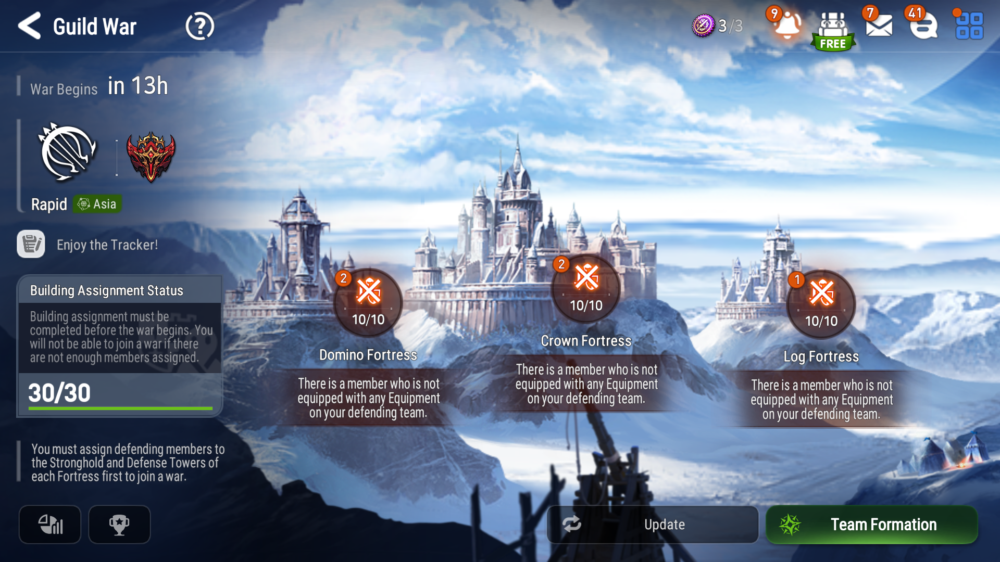

# ArkGWTrackerUploader

A tool to automatically collect and upload Epic Seven Guild War defense data.

---

## 📦 How to Use

1. **Extract** all files from the release zip to a folder (keep the folder structure!).
2. **Make sure BlueStacks is running with ADB enabled at 1920 by 1080** and you are logged into Epic Seven.
3. **Navigate to the Guild War page** in the game.  
   _You should be on the following screen before starting the uploader:_

   

4. **Run `ArkGWTrackerUploader.exe`** (double-click or run from command line).
5. **Enter your daily upload code** when prompted, you can find the code on your account page on the [Ark Guild War Tracker](https://ark-gw-tracker-web.vercel.app) site after logging in (must be exactly 12 characters).
6. **Follow the on-screen instructions**.  
   - The tool will collect data automatically.
   - Press `ESC` at any time to stop.

7. **After upload** you can safely close the program.

---

## ⚠️ Notes

- **Do not move or rename any folders** (`adb`, `heroData`, `outcome_images`).
- The uploader does **not** require Python or any installation.
- If you have issues connecting to BlueStacks, try running as administrator.

---

## 📧 Support

For questions or issues, please send me and email arktey.dev@gmail.com or open an issue on the [GitHub repository](https://github.com/Arktey/ArkGWTrackerUploader). 
